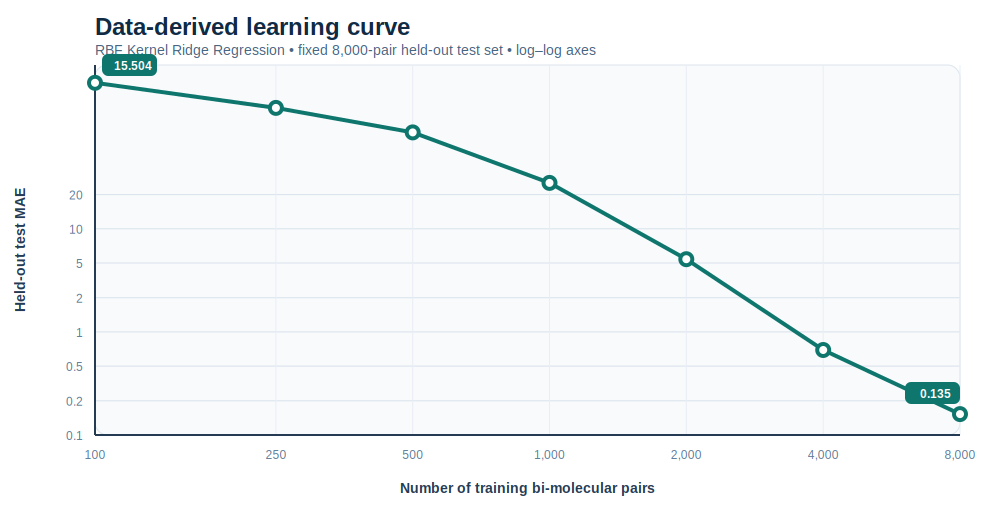
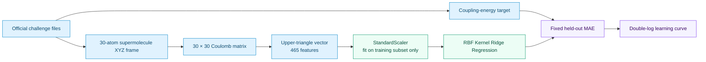

# Wuppertal Bi-Molecular ML Challenge

<p align="center">
  <strong>Excitonic-coupling regression from molecular-pair geometry</strong><br>
  Coulomb-matrix representation · RBF Kernel Ridge Regression · reproducible held-out evaluation
</p>

<p align="center">
  <a href="../../actions/workflows/python-checks.yml"></a>
  
  
  
  <a href="LICENSE"></a>
</p>

> **Scope.** This repository documents an executed baseline for the University of Wuppertal bi-molecular machine-learning challenge. The original challenge dataset is not included. Only derived result tables and self-contained visualizations are committed.

---

## ✨ Result at a glance

<p align="center">
  
</p>

The baseline learned a scalar excitonic-coupling target from **40,000 supplied molecular-pair records**. Increasing the training set from 100 to 8,000 pairs reduced the fixed-holdout MAE from **15.504** to **0.135**: a **99.13% decrease** on the same 8,000-pair held-out partition.

| Metric | Executed value |
|---|---:|
| Molecular-pair records | 40,000 |
| Supermolecule size | 30 atoms |
| Coulomb-matrix feature length | 465 upper-triangle entries |
| Candidate training pool | 30,000 pairs |
| Reserved validation partition | 2,000 pairs |
| Held-out test partition | 8,000 pairs |
| Random seed | 104729 |
| Final evaluated training size | 8,000 pairs |
| Held-out test MAE at 8,000 pairs | **0.134879** |

---

## 🧪 Problem and approach

The task is to predict one scalar coupling value for a pair of molecular geometries. Rather than modelling the two molecules independently, the experiment uses each supplied **30-atom supermolecule geometry**. This retains intramolecular terms and cross-molecule distance terms in one descriptor.



For atomic numbers $Z_i$ and Cartesian coordinates $R_i$, the Coulomb matrix is

$$
C_{ii}=0.5Z_i^{2.4},\qquad
C_{ij}=\frac{Z_iZ_j}{\lVert R_i-R_j\rVert}\quad(i\ne j).
$$

The upper triangular entries, including the diagonal, form a fixed 465-dimensional vector. The model pipeline is:

```python
StandardScaler() → KernelRidge(kernel="rbf", alpha=1e-6, gamma=γ)
```

Here, $\gamma$ is recalculated from a training-only median squared-distance heuristic for each learning-curve point. Across the reported curve, $\gamma$ ranged from approximately $1.2029\times10^{-4}$ to $1.2207\times10^{-4}$.

---

## 📈 Learning-curve results

Every point below uses the **same untouched 8,000-pair test partition**. The active training subset grows within the candidate-training pool. `StandardScaler` is fitted only on the active training subset before model fitting.

| Training pairs | Held-out test MAE | RBF $\gamma$ | $\alpha$ |
|---:|---:|---:|---:|
| 100 | 15.504196 | 1.21115e-4 | 1e-6 |
| 250 | 10.822237 | 1.21367e-4 | 1e-6 |
| 500 | 7.613479 | 1.21761e-4 | 1e-6 |
| 1,000 | 3.696746 | 1.20492e-4 | 1e-6 |
| 2,000 | 1.239947 | 1.20286e-4 | 1e-6 |
| 4,000 | 0.337647 | 1.22068e-4 | 1e-6 |
| 8,000 | **0.134879** | 1.22033e-4 | 1e-6 |

The machine-readable source for this table is available in [`results/learning_curve_results.csv`](results/learning_curve_results.csv).

### What this curve shows

- The error declines monotonically as more molecular-pair samples are added.
- The largest absolute reduction occurs at smaller training sizes; the curve continues to improve substantially from 2,000 to 8,000 pairs.
- The 4,000-to-8,000 increase reduces held-out MAE from 0.338 to 0.135, a further **60.05% reduction**.
- This is a **random-pair holdout baseline**. Because molecular geometries may recur across pair records, a geometry-disjoint split is an important next robustness check rather than a claim made by this baseline.

---

## 🧭 Evaluation design

<p align="center">
  
</p>

| Design choice | Implemented decision | Why it matters |
|---|---|---|
| Dataset split | 30,000 candidate-train / 2,000 validation / 8,000 test | Keeps test data separate from model fitting. |
| Learning-curve metric | MAE on the fixed test partition | Makes every training-size point directly comparable. |
| Feature scaling | Fit on current training subset only | Avoids information leakage through feature normalization. |
| Kernel width | Training-only median-distance heuristic | Keeps the RBF scale matched to the active subset. |
| Regularization | $\alpha=10^{-6}$ | Provides a low-regularization baseline for the RBF-KRR model. |
| Randomness | Fixed seed 104729 | Allows the reported split and curve to be reproduced. |

---

## 🧬 Representation rationale

<p align="center">
  
</p>

| Representation decision | Effect |
|---|---|
| Use `Coord_supermol.xyz` | Preserves the complete paired geometry in a single molecular object. |
| Include cross-molecule Coulomb terms | Encodes distance-dependent interaction information between the two molecules. |
| Use the upper triangle | Avoids duplicating symmetric matrix entries while retaining all diagonal and pairwise terms. |
| Standardize before RBF-KRR | Prevents a few high-magnitude features from dominating Euclidean kernel distances. |

---

## 🗂️ Repository guide

```text
.
├── assets/
│   ├── learning_curve_results.svg   Data-derived result figure
│   ├── system_architecture.svg      Conceptual system diagram
│   ├── evaluation_protocol.svg      Evaluation-design diagram
│   └── research_lifecycle.svg       Reproducible workflow diagram
├── results/
│   └── learning_curve_results.csv   Executed numerical learning-curve table
├── configs/                          Reproducible experiment settings
├── data/                             Local-data placement documentation
├── docs/                             Methodology and required LLM interaction record
├── notebooks/                        Experiment walkthroughs
├── scripts/                          Command-line entry points
├── src/                              Descriptor, split, model, and visualization modules
└── tests/                            Unit tests using synthetic geometries only
```

---

## ▶️ Reproducing the baseline locally

1. Obtain `BiMolData.tgz` from the official challenge source and extract it locally.
2. Place the four supplied files under `data/raw/`:

```text
Coord_A.xyz
Coord_B.xyz
Coord_supermol.xyz
CouplingEnergies.csv
```

3. Set up the environment and run the project workflow:

```bash
python -m venv .venv
source .venv/bin/activate  # Windows: .venv\Scripts\activate
python -m pip install --upgrade pip
python -m pip install -r requirements.txt
python scripts/inspect_data.py
python -m pytest
```

The original raw data remain excluded from version control. This protects the challenge files while leaving the implementation, data-derived summary, and documentation available for review.

---

## ⚠️ Interpretation boundary

This repository reports one executed RBF-KRR baseline, not a claim of universal molecular-property accuracy. The current curve uses a random pair-level holdout; it is appropriate for a conventional interpolation baseline but may overstate geometric transfer when molecular identities recur across different pairs. A geometry-disjoint evaluation, uncertainty analysis, and multi-fidelity training strategy are natural next steps.

---

## Transparency record

The challenge requires participants who use LLM assistance to include their complete prompt history in the compressed submission archive. The project maintains that required record alongside the submission materials. The final technical claims in this README are limited to the executed result table and documented protocol above.

## License

Released under the [MIT License](LICENSE). Raw challenge data are not included and may be subject to separate restrictions.
