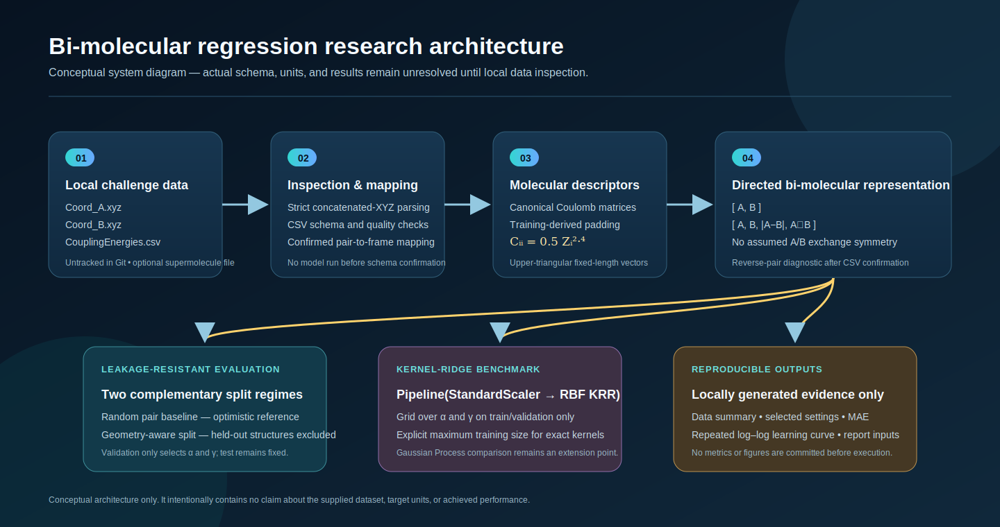
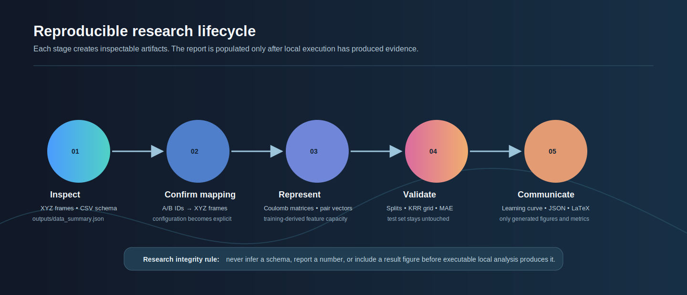
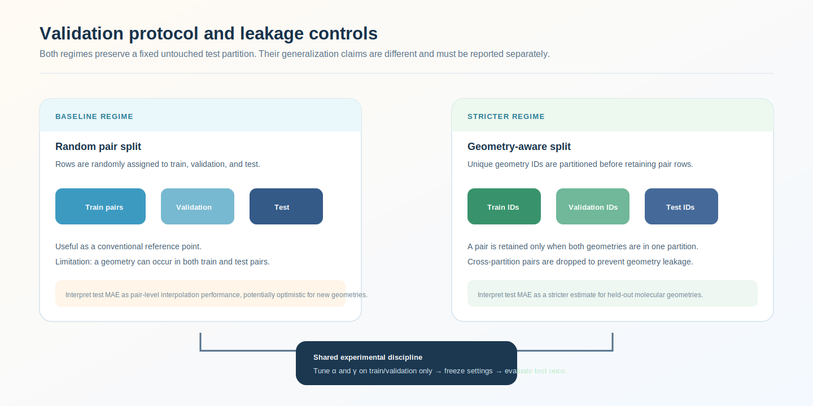

# Wuppertal Bi-Molecular ML Challenge

<p align="center">
  <strong>Reproducible bi-molecular machine learning for scalar excitonic-coupling regression</strong>
</p>

<p align="center">
  <a href="../../actions/workflows/python-checks.yml"></a>
  <a href="LICENSE"></a>
  
  
</p>

> **Research boundary.** This repository is a doctoral-application research codebase. Raw challenge files remain local in `data/raw/`, are excluded from Git, and no numerical result, chart, or conclusion is included until executable code generates it from the supplied data.

---

## Research objective

The task is to predict one scalar excitonic-coupling value from a **directed pair of molecular geometries**. The project implements a scientifically cautious workflow around Coulomb-matrix molecular descriptors and RBF Kernel Ridge Regression (KRR), with explicit checks for data mapping, leakage, computational limits, and reproducibility.

The repository is intentionally designed to answer two different questions:

| Evaluation question | Split strategy | What the result can mean |
| --- | --- | --- |
| How well can the model interpolate among observed molecular-pair rows? | Random pair split | Conventional pair-level baseline; may be optimistic if geometries recur across splits. |
| How well does the model transfer to held-out geometries? | Geometry-aware split | Stricter test; no retained test geometry is available in training. |

## Current project stage

```text
[✓] Research scaffold, tests, configs, documentation, visual assets
[✓] Strict XYZ parser and Coulomb-matrix feature implementation
[✓] Pair-feature, KRR, split, learning-curve, and plotting modules
[✓] Raw-data protection and prompt-history record
[ ] Local raw-file inspection
[ ] Confirmed CSV schema and XYZ frame mapping
[ ] Executed baseline, learning curve, final test, and report
```

No stage marked incomplete is being simulated or claimed as complete.

---

## Conceptual system architecture

<p align="center">
  
</p>

This is a **conceptual workflow diagram**, not a result figure. It records the intended research pipeline without assuming the supplied CSV columns, target units, atom counts, or pair-index convention.

---

## Why this repository is research-grade

| Research concern | Design decision in this codebase |
| --- | --- |
| Dataset integrity | The first command inspects actual XYZ and CSV files; schema fields remain unresolved until confirmed. |
| Molecular representation | Coulomb matrix uses the requested diagonal and off-diagonal definitions, canonical ordering, training-derived padding, and upper-triangular vectorization. |
| Pair directionality | The default representations preserve A/B roles; no symmetry assumption is made. |
| Leakage control | Random-pair and geometry-aware splits are both implemented and documented. |
| Model selection | KRR `alpha` and `gamma` are selected with validation data only. |
| Final evaluation | The test partition is fixed and used only after model choices are frozen. |
| Computational safety | Exact KRR is capped by configurable maximum training size. |
| Reproducibility | Fixed seeds, YAML configuration, unit tests, GitHub Actions, and structured local outputs. |
| Scientific communication | Placeholder-only LaTeX report template; figures appear only after local execution. |

---

## Reproducible research lifecycle

<p align="center">
  
</p>

The workflow intentionally pauses after inspection. That pause is essential: the code must learn the real file schema and mapping from the supplied data rather than creating hidden assumptions.

---

## Dataset placement and privacy boundary

Create the following local directory after cloning:

```text
data/raw/
├── Coord_A.xyz
├── Coord_B.xyz
├── CouplingEnergies.csv
└── Coord_supermol.xyz        # optional; not assumed by the first workflow
```

`data/raw/` is ignored by Git. Do **not** upload these raw files unless you receive explicit permission. See [`data/README.md`](data/README.md) for the data dictionary boundary and expected local placement.

---

## Quick start

### 1. Clone and create an environment

```bash
git clone https://github.com/Hirakhyzer/wuppertal-bimolecular-ml-challenge.git
cd wuppertal-bimolecular-ml-challenge

python -m venv .venv
```

Windows:

```bat
.venv\Scripts\activate
```

macOS/Linux:

```bash
source .venv/bin/activate
```

Install the pinned project requirements:

```bash
python -m pip install --upgrade pip
python -m pip install -r requirements.txt
```

### 2. Copy the supplied files locally

Place the untracked files under `data/raw/` using the exact names above.

### 3. Inspect before modelling

```bash
python scripts/inspect_data.py
```

This executable step:

- parses all concatenated XYZ frames from `Coord_A.xyz` and `Coord_B.xyz`;
- records atom-count distributions and file dimensions;
- inspects the real `CouplingEnergies.csv` header, types, missing values, duplicates, and numeric columns;
- notes whether the optional supermolecule file exists;
- writes `outputs/data_summary.json`.

After reading that JSON, rerun with **confirmed** target and pair-ID columns:

```bash
python scripts/inspect_data.py \
  --target-column <confirmed_target_column> \
  --pair-a-column <confirmed_A_identifier_column> \
  --pair-b-column <confirmed_B_identifier_column>
```

### 4. Run unit tests

```bash
python -m pytest
```

The tests use only tiny synthetic geometries embedded in the test suite. They never use or upload the challenge data.

---

## Data-to-feature methodology

### Molecular geometry parsing

The parser treats an XYZ file as a sequence of frames:

```text
<number of atoms>
<comment line>
<element> <x> <y> <z>
...
```

Malformed boundaries, truncated frames, unknown element symbols, or invalid coordinates raise an error rather than being silently skipped.

### Coulomb-matrix representation

For atomic numbers \(Z_i\) and Cartesian coordinates \(R_i\), the descriptor is

\[
C_{ii} = 0.5 Z_i^{2.4}, \qquad
C_{ij} = \frac{Z_iZ_j}{\lVert R_i-R_j\rVert} \quad (i \ne j).
\]

The workflow:

1. builds a square Coulomb matrix for each geometry;
2. canonically reorders it using row norms with a permutation-invariant signature tie-breaker;
3. pads matrices to a capacity derived from training geometries;
4. flattens the upper triangle, including the diagonal.

This is a principled fixed-length descriptor, but it is not a guarantee of unique molecular identity. That limitation belongs in the final report.

### Directed pair features

The project supports two pair-level feature families:

| Mode | Feature vector | Direction preserved? |
| --- | --- | --- |
| `directed_concatenation` | \([A, B]\) | Yes |
| `interaction_features` | \([A, B, |A-B|, A\odot B]\) | Yes |

The target is **not** assumed to be invariant to swapping A and B. After the real pair columns are confirmed, the inspection stage can quantify observed reverse-pair differences before any optional symmetric representation is considered.

---

## Evaluation design

<p align="center">
  
</p>

### Random-pair baseline

A reproducible random split of pair rows into train, validation, and test sets. It is useful as a conventional reference, but the same geometry may occur in different partitions.

### Geometry-aware split

Unique geometry identifiers are assigned to train, validation, or test partitions first. Only pairs whose two members remain inside one partition are retained. Cross-partition pairs are dropped explicitly. This is stricter and may leave fewer usable samples, but it prevents retained test geometries from appearing in training.

### Hyperparameter discipline

The main model is always:

```python
Pipeline([
    ("scaler", StandardScaler()),
    ("krr", KernelRidge(kernel="rbf", alpha=alpha, gamma=gamma)),
])
```

`alpha` and `gamma` are searched using **training and validation data only**. Test MAE is reserved for the final fixed held-out evaluation.

---

## Planned local experiment commands

The configuration files deliberately contain `null` schema fields at first. The following commands will stop safely until you inspect the data and confirm the true mapping.

```bash
python scripts/run_baseline.py --config configs/baseline_krr.yaml
python scripts/run_learning_curve.py --config configs/learning_curve.yaml
python scripts/run_final_experiment.py --config configs/baseline_krr.yaml
```

### Learning curve specification

Once mapping is implemented and schema fields are confirmed, the learning-curve workflow will:

- use feasible logarithmic training sizes such as `100, 250, 500, 1000, 2000, 4000`;
- cap the size based on available training samples and the configured KRR safety limit;
- repeat each feasible size over fixed seeds;
- save mean and standard deviation of validation MAE;
- generate only locally:

```text
outputs/results/learning_curve_results.csv
outputs/figures/learning_curve_loglog.png
outputs/figures/learning_curve_loglog.pdf
```

---

## Repository map

```text
.
├── assets/                 Conceptual SVG architecture and protocol figures
├── configs/                Dataset-agnostic, reproducible YAML settings
├── data/                   Local-data placement documentation; raw folder ignored
├── docs/                   Methodology, prompt history, report template
├── notebooks/              Inspection, KRR, and learning-curve walkthroughs
├── outputs/                Local-only generated results and figures
├── scripts/                Command-line entry points
├── src/                    Tested research implementation
│   ├── xyz_parser.py       Concatenated XYZ parsing and atom validation
│   ├── coulomb_matrix.py   Descriptor, canonicalization, padding, vectorization
│   ├── pair_representation.py
│   ├── splits.py           Random-pair and geometry-aware split policies
│   ├── models.py           RBF KRR pipeline and validation search
│   ├── learning_curve.py
│   └── visualization.py
└── tests/                  Unit tests on small synthetic examples
```

---

## Generated artifact contract

The repository does not ship with precomputed outcomes. After genuine local execution, expected artifacts are:

| Artifact | Created by | Purpose |
| --- | --- | --- |
| `outputs/data_summary.json` | `inspect_data.py` | Auditable summary of actual local files |
| `outputs/results/*.json` | experiment scripts | Seed, split, selected settings, and generated MAE records |
| `outputs/results/learning_curve_results.csv` | learning-curve script | Repeated validation-learning-curve table |
| `outputs/figures/learning_curve_loglog.png/.pdf` | visualization module | Double-logarithmic learning curve |
| `docs/report_template.tex` | user-populated after execution | One-page report containing real generated evidence only |

---

## Documentation

- [`docs/methodology.md`](docs/methodology.md) — descriptor, split, KRR, learning-curve, and limitation details.
- [`docs/LLM_PROMPT_HISTORY.md`](docs/LLM_PROMPT_HISTORY.md) — immutable first build prompt; manually append future LLM interactions.
- [`docs/report_template.tex`](docs/report_template.tex) — placeholder-only one-page report template.
- [`data/README.md`](data/README.md) — dataset location and raw-data handling boundary.

---

## Scientific limitations

1. Dataset schema, target units, atom counts, and pair mapping are unknown until local inspection.
2. Coulomb matrices are not perfectly unique molecular descriptors.
3. Random pair splits can overstate transfer performance when structures recur.
4. Geometry-aware splits may remove many cross-partition pairs.
5. Exact RBF KRR scales poorly at large sample counts, so the configured safety limit must be respected.
6. `Coord_supermol.xyz` is optional and is not used unless inspection demonstrates a justified role.
7. No final claim should be made from this repository until the actual code has run on the supplied data.

---

## License

Released under the [MIT License](LICENSE). Raw challenge data are not included and may be subject to separate restrictions.
